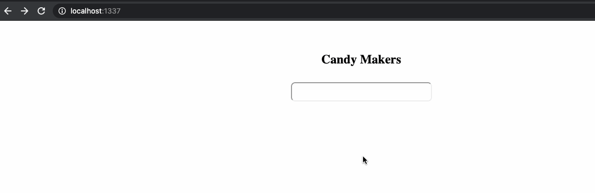
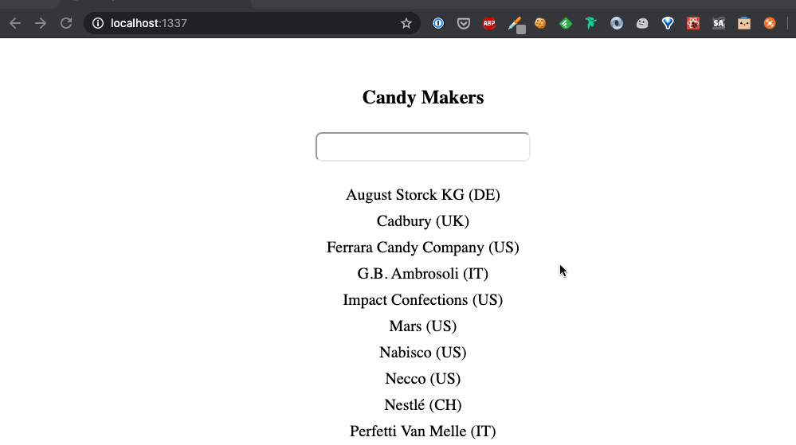
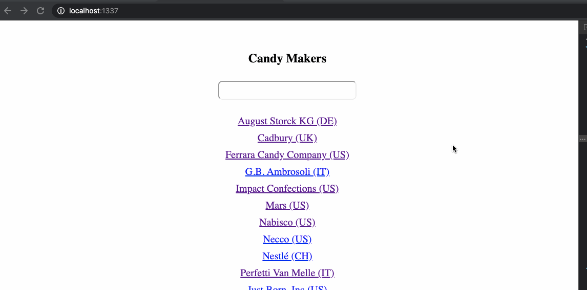

# Candy Maker API

## Part One Instructions
In the initial commit of this project you have been provided with an API server and the basic project setup for a React project. In a new branch called `part-one-answer`, your task is to clean up your mono-repo following the best practices laid out in class. Specifically:
1) Your Node code should be compiled with Babel so that it can utilize the last ES features
2) Your React site should be served by your Express server such that routes with `/api` call the REST API and all other routes return the React app
3) Your ESLint rules should be updated to use the React rules and `npm run lint` should return no errors
4) The `npm run dev` command should spin up both your client and server in watch mode

## Part Two Instructions
Continuing from your `part-one-answer` branch, in a new branch called `part-two-answer`, your task is to create a React page that retrieves a list of Candy manufacturers from the API and displays them on the screen. This page should also have a search box that updates the list of manufacturers displayed to only those whose name matches the search term typed by the user.

## Part Three Instructions
Continuing from your `part-two-answer` branch, in a new branch called `part-three-answer`, your task is to create a multi-page React application. Each manufacturer on the existing page should be a link to a page which displays all of the products made by that manufacturer. All components for these pages should utilize Styled Components, no external CSS should be used.

## Part Four Instructions
Continuing from your `part-three-answer` branch, in a new branch called `part-four-answer`, your task is to create a test suite that contains tests for each of the components used in your application.
